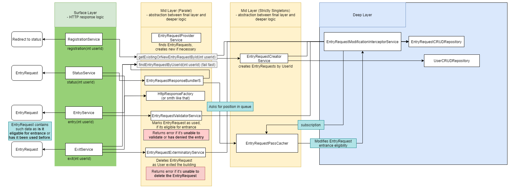
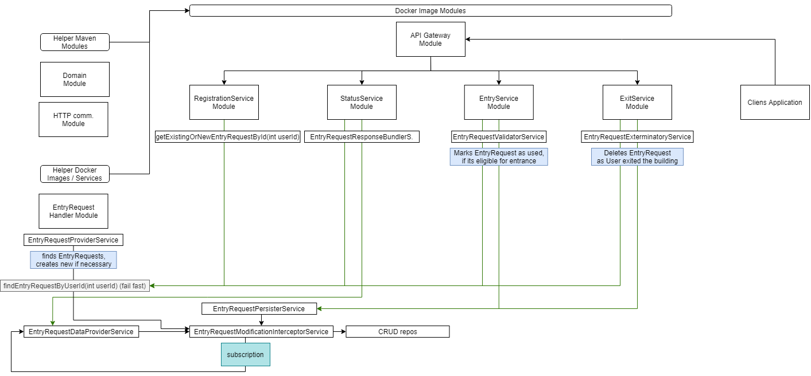

# reboarding
Solution for rebaording 2.0 competition

## mostly random notes we took while browsing on stackoverflow
### setting up *multimodule maven project*
```
# creating the parent module:
mvn archetype:generate -B -Dversion=0.0.1-SNAPSHOT -DgroupId=[com.example] -DartifactId=[smth-app]
# go into parent folder
cd [smth-app]
# creating the submodules
mvn archetype:generate -B -Dversion=0.0.1-SNAPSHOT -DgroupId=[com.example]  -DartifactId=[smth-domain]
mvn archetype:generate -B -Dversion=0.0.1-SNAPSHOT -DgroupId=[com.example]  -DartifactId=[smth-service]
mvn archetype:generate -B -Dversion=0.0.1-SNAPSHOT -DgroupId=[com.example]  -DartifactId=[smth-web]
```
#### extras:
Use `-B` to execute as batch operation so it won't ask for any user input.

## Service Flow Chart


## Module Flow Chart


